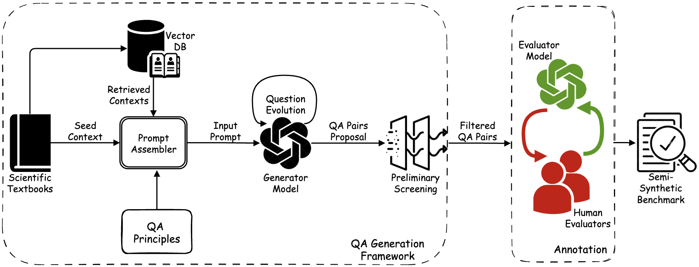

<div align="center">

# ClimaQA: An Automated Evaluation Framework for Climate Question Answering Models [ICLR 2025]


<h3> ✨Official implementation of the <a href="https://arxiv.org/abs/2410.16701">ClimaQA</a> paper✨ </h3>
 

<br/><br>

</div>
If you use this code, please consider citing our work. Copy the bibtex from the bottom of this Readme or cite as:

> [ClimaQA: An Automated Evaluation Framework for Climate Question Answering Models](https://arxiv.org/abs/2410.16701),\
Veeramakali Vignesh Manivannan, Yasaman Jafari, Srikar Eranky, Spencer Ho, Rose Yu, Duncan Watson-Parris, Yian Ma, Leon Bergen, Taylor Berg-Kirkpatrick,\
*The Thirteenth International Conference on Learning Representations*, 2025

The code is organized into two independent sections:

- **ClimaGen** – for QA dataset generation with domain experts (users can also generate datasets directly without expert involvement by skipping the adaptive learning section).
- **Evaluation** – for directly assessing models on the CLIMAQA-GOLD dataset.

## ClimaGen
ClimaGen is an adaptive learning framework for
creating benchmarks in collaboration with domain experts to evaluate scientific question-answering
models, specifically for climate science but adaptable to other scientific disciplines. The code provided is tightly coupled with OpenAI api and therefore it is reccomended that you have a paid OpenAI account to avoid rate limitation issues. One can also modify the code to use open-source LLMs if needed.

To get started, set up the environment as follows:
```
cd climagen/server
pip install -r requirements.txt
export PYTHONPATH=$(pwd):$PYTHONPATH 
```

Then, set the `OPENAI_API_KEY` env variable in the `climagen/server/.env` file accordingly

### Textbook Database

Curating the textbook database is crucial for the framework. The textbook data used in the project can not be open sourced due to copyright issues. However we provide a sample of the collected data in `sample_textbook_data.csv`. The vector database can be created as follows:

```
python scripts/create_vector_db.py --input sample_textbook_data.csv 
```

The framework can be easily extended to other scientific disciplines by using the relevant textbook data. Please curate the text data in the same format as in the sample csv file.

### QA Pair Generation
The synthetic dataset consisting of question-answer pairs can be generated from the vector db as shown below.

```
python scripts/generate_dataset.py --type MCQ -n 7
```
The script takes 2 arguments:
- **--type (required)**: The type of the questions that needs to be generated. Values include *MCQ*, *FREE_FORM*, *CLOZE*
- **-n**: Minimum number questions that needs to be generated. Default: 10

The outputs will be stored in the result directory.

>**Note:** The script uses gpt-4o-mini as the default annotator model. We can not release the fine-tuned models developed in the project as OpenAI does not allow it. One can create a fine-tuned model based on the framework below can use it for improved performance if needed.

### Adaptive Learning (Web App)

The adaptive learning (active finetuning) pipeline is built as a web application where the domain experts label the generated QA pairs as valid/invalid and the evaluator models are fine-tuned in parallel with this process.

#### Firebase
To run this pipeline successfully, you will need to configure a firebase database. Firebase is used to store the validated QA pairs aswell as handle user authentication. Please follow the following steps to configure the firebase project:

- Create a firebase project [here](https://console.firebase.google.com/u/0/)
- Go to *Project Settings* and add a *web app* to your project
- Copy the generated `firebaseConfig` of the app to corresponding variable in `climagen/ui/src/firebase/firebase.js`
- Go to *service accounts* tab in *Project Settings* and click *Generate New Private Key*. A config json file will be downloaded
- Store the downloaded file as `climagen/server/firebase-config.json`
- Setup *Cloud Firestore* and *Authentication* for the project directly through the console with the default settings. Make sure to enable *Google* as a provider for authentication

#### Backend
The backend is set up as a fast-api server. One can install the requirements and run the server as follows:

```
uvicorn src.app:app --host 0.0.0.0
```

Running the server for the first time automatically creates the collections in the firebase db. 

>**Note:** Sometimes it throws the following error: google.api_core.exceptions.FailedPrecondition: 400 The query requires an index. You can create it here:... One can easily create the index by following the link in the error. This needs to be done only once.  

#### UI
The frontend is set up as a react.js web ui. One can install the requirements and run the ui as follows:

```
cd climagen/ui
npm install
npm start
```

After logging in atleast once, choose an admin user and copy the respective *USER_UID* (can be found in the firebase authentication console) and paste it in `climagen/server/.env`. This user will have admin access and will be able to see questions vlaidated by all users.

## Evaluation

The evaluation notebooks `mcq_evaluation.ipynb`, `freeform_evaluation.ipynb` and `cloze_evaluation.ipynb` contain code to download the *ClimaQA-Gold* dataset, visualize data samples and evaluation metrics. We have inclulded implementations of *default*, *few-shot* and *rag* settings. Alternatively, one can directly download the dataset from [HuggingFace](https://huggingface.co/datasets/UCSD-GENIE/ClimaQA) and use it as per their requirements.

We provide code to evaluate OpenAI and open-source models using the [Together AI](https://www.together.ai/) API. The environment can be setup as follows:

```
cd evaluation
pip install -r requirements.txt 
```

Then, set the `OPENAI_API_KEY` and `TOGETHER_API_KEY` env variables in the `evaluation/.env` file accordingly

One can easily test any custom model by implementing a new CustomLLMAgent similar to the ones here.

## Citation

    @inproceedings{
    manivannan2025climaqa,
    title={Clima{QA}: An Automated Evaluation Framework for Climate Question Answering Models},
    author={Veeramakali Vignesh Manivannan and Yasaman Jafari and Srikar Eranky and Spencer Ho and Rose Yu and Duncan Watson-Parris and Yian Ma and Leon Bergen and Taylor Berg-Kirkpatrick},
    booktitle={The Thirteenth International Conference on Learning Representations},
    year={2025},
    url={https://openreview.net/forum?id=goFpCuJalN}
    }